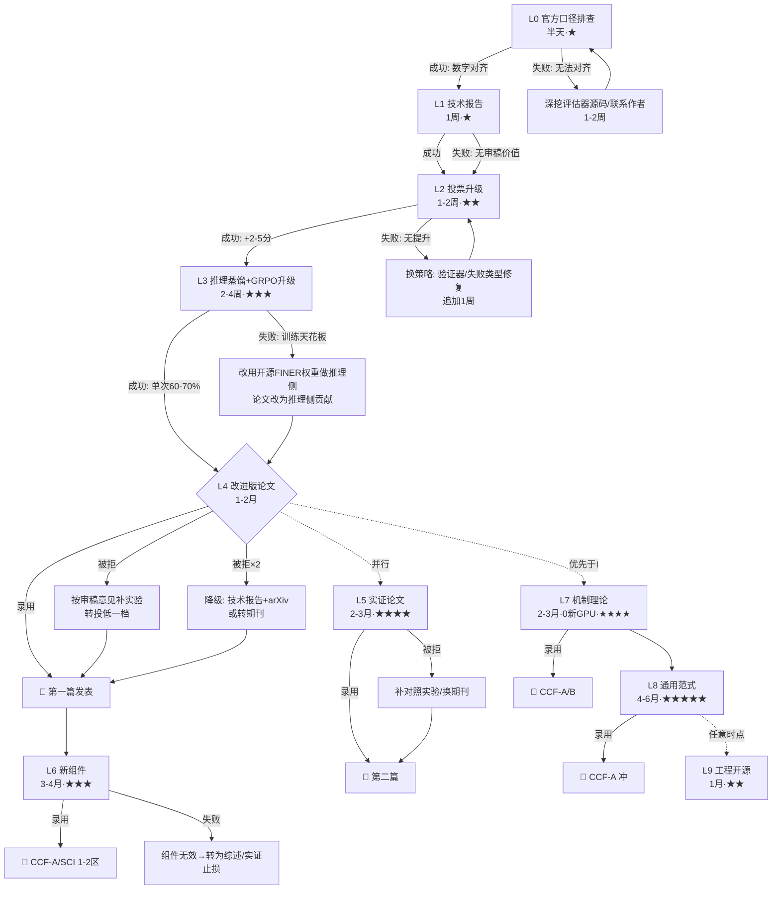

# 论文发表规划（从简单到难，含等级与分支决策）

> 2026-08-12 制定，2026-08-13 扩展 L7/L8/L9。目标：基于现有 Text-to-SQL GRPO 项目 + FINER-SQL 复刻，发表改进型论文。
> 定位：小模型（≤3B/7B）Text-to-SQL 强化学习——"从复现到超越 FINER-SQL"。

## 〇、学术深度阶梯（L6 往上，2026-08-13 定义）

用做菜打比方，学术贡献的"深度"分档：

| 层 | 实质 | 比喻 |
|:---:|------|------|
| L4 | 改进应用："别人的方法 + 我的改良" | 做菜改良 |
| L5 | 实证规律："我发现了一堆规律" | 写菜谱研究报告 |
| L6 | 新组件："我发明了新厨具" | 新方法 |
| **L7** | **机制理论："我解释了为什么"** | **研究烹饪科学（比 L6 更深刻）** |
| **L8** | **通用范式："我的规律适用于所有菜系"** | **统一理论（更深）** |
| **L9** | **工程开源："我的厨具免费送大家"** | **工具贡献** |

**核心理念**：顶会（ICML/NeurIPS）最爱"有理论洞察的实验"——不是堆方法，而是解释机制。"解释为什么"比"发明什么"更吃香，且 L7 用现有数据就能做（0 新 GPU）。

## 一、任务梯度总览（简单 → 难）

| 层 | 任务 | 发表等级 | 难度 | 周期 | 依赖 |
|:---:|------|---------|:---:|:---:|:---:|
| L0 | 官方口径排查（76.6% vs 85%） | 无（一切前提） | ★ | 半天 | — |
| L1 | 修 bug 技术报告（arXiv） | 预印本 | ★ | 1 周 | L0 |
| L2 | 投票升级实验（多视角×采样+置信度） | 论文组件 | ★★ | 1-2 周 | L0 |
| L3 | 推理蒸馏 + GRPO 算法升级 | 论文主体 | ★★★ | 2-4 周 | L0, L2 |
| L4 | **改进版 FINER 论文（A 方案）** | CCF-B/C、SCI 2-3 区 | ★★★ | 1-2 月 | L1-L3 |
| L5 | 系统性实证论文（B 方案） | CCF-B、SCI 2 区 | ★★★★ | 2-3 月 | L4（可并行） |
| L6 | 新组件方法（C 方案） | CCF-A/B、SCI 1-2 区 | ★★★ | 3-4 月 | L4 |
| L7 | **机制理论论文**（投票失效边界/信号稀释假说，"解释为什么"） | CCF-A/B | ★★★★ | 2-3 月 | L4（数据已有，0 新 GPU） |
| L8 | **通用范式论文**（跨任务验证通用配方，SQL→数学/代码） | CCF-A（冲） | ★★★★★ | 4-6 月 | L7 |
| L9 | **工程开源**（vav 评估器 + MPEV 投票库 + 复现管线） | 工具类（MLSys/Data-centric） | ★★ | 1 月 | 随时 |

## 二、发表等级参考（Text-to-SQL 相关）

| 级别 | 会议/期刊 | 难度 | 说明 |
|:---:|-----------|:---:|------|
| **CCF-A** | ACL / EMNLP / NAACL / AAAI / NeurIPS / **ICDE**（FINER 发的） | 极高 | 需要方法创新+完整实验+写作 |
| **CCF-B** | COLING / EACL / CIKM / DASFAA / DASFAA | 高 | 改进型工作有机会 |
| **CCF-C** | 部分会议（如 NLPCC、CCL） | 中 | 改进型工作较稳 |
| **SCI 1-2 区** | 期刊（如 Knowledge-Based Systems 等） | 中高 | 期刊周期长（3-6 月审稿） |
| **SCI 3-4 区** | 一般期刊 | 中低 | 保底选项 |
| **arXiv 预印本** | 无等级 | 低 | 展示工作、占坑，不算正式发表 |

**现实建议**：目标 **CCF-B 会议（如 COLING/EMNLP-Findings）或 SCI 2 区期刊**，冲刺 CCF-A（ICDE/EMNLP）。

## 三、规划图（mermaid）

## 四、详细步骤计划（每步含分支决策）

### L0：官方口径排查（半天，一切前提）
- **目标**：官方 EX 76.6% vs FINER 论文 85% 的差异归因
- **成功标准**：找到差异来源（评估器版本/plug_value/多实例库），数字对齐到 82-85%
- **成功** → L1；**失败（无法对齐）** → 深挖评估器源码/联系 FINER 作者（1-2 周），如实报告 76.6% 也可接受（论文里说明评估差异）

### L1：技术报告（1 周）
- **目标**：arXiv 技术报告《Correcting Degenerate-Group Skipping in Execution-based Voting for Text-to-SQL》
- **内容**：复现 FINER 时的 bug 发现 + 修复（+6.4pp）+ vav 移植实现
- **成功标准**：发布到 arXiv，抢占话题
- **成功** → 为 L4 提供素材；**失败（无审稿价值）** → 并入 L4 论文的 Section（不单独发）

### L2：投票升级（1-2 周，纯推理侧）
- **目标**：多视角×采样投票 + 置信度过滤 + 失败类型感知修复
- **成功标准**：官方口径 +2-5pp（≥78% 自定义）
- **成功** → L3；**失败** → 换策略（训练验证器 ORM / 加权投票），追加 1 周再试

### L3：推理蒸馏 + GRPO 算法升级（2-4 周）
- **目标**：DeepSeek 生成推理数据 → SFT（单次 50→60-70%）；GRPO 升级（DAPO/去std/零方差过滤）验证
- **成功标准**：单次生成 ≥60%（全量口径）
- **成功** → L4 完整故事（训练+推理双侧贡献）
- **失败（训练天花板）** → 用开源 FINER 权重做推理侧贡献，论文定位改为"推理侧方法改进"，照样能写

### L4：改进版论文（1-2 月）
- **目标**：CCF-B（COLING/EMNLP-Findings）或 SCI 2 区
- **故事线**："小模型 Text-to-SQL：从复现 FINER-SQL 到超越（多视角投票 + bug 修复 + 数据策略）"
- **录用** → 🎉；**被拒 1 次** → 按审稿意见补实验，转投低一档；**被拒 2 次** → 降级 arXiv 技术报告 + 转期刊（SCI 3-4 区保底）

### L5：实证论文（2-3 月，可与 L4 并行）
- **目标**："小模型 Text-to-SQL RL 的配方与瓶颈"（子集偏差/训练天花板/投票鲁棒性/数据量无关性）
- **卖点**：40+ 实验系统分析 + 反直觉发现
- **风险**：审稿人质疑新颖性 → 用"系统性+首次验证"包装；被拒 → 补对照实验 + 换期刊

### L6：新组件（3-4 月，L4/L5 之后）
- **目标**：CCF-A（ICDE/EMNLP）或 SCI 1-2 区
- **方向**：执行感知 memory 奖励 / 动态奖励课程 / 多视角 vav 的理论分析
- **失败止损线**：组件验证 2 次无提升 → 停止，转为综述或并入实证论文
- **注**：与 L7 相比，L6 是"改组件"（应用层），L7 是"解释为什么"（科学层）——**L7 性价比更高，优先于 L6**

### L7：机制理论论文（2-3 月，**0 新 GPU，纯分析现有数据**）
- **定位**：不发明组件，而是解释"为什么有效/失效"——顶会最爱的理论洞察
- **候选理论问题（素材全在手里）**：
  1. **投票何时失效？**（投票一致度曲线 5票=100%→0票=0%、子集偏差、官方口径下降）→ 给出**自适应投票准则**：什么时候该信投票、什么时候该回退——从"投票方法"升级为"投票科学"
  2. **为什么训练数据量无关？**（100-7000 条训练无单调趋势）→ 分析奖励信号饱和（静默组比例、reward_std 变化）→ "小模型 RL 信号稀释假说"
  3. **为什么投票抹平训练差异？**（任何训练状态投票后 70-71%）→ 从生成分布视角解释：投票本质上是"分布取模"
- **论文骨架（题目候选）**：《When Does Voting Fail? Understanding Multi-Perspective Voting in Small-Model Text-to-SQL RL》
  1. 投票一致度-正确率曲线（已有）
  2. 投票失效的边界（低置信区/超严格口径/子集偏差）
  3. 自适应投票准则（置信度阈值自适应）
  4. 与训练信号的联系（为什么投票抹平训练差异）
- **卖点**：数据已有 / 不需要新 GPU / "解释为什么"比"发明什么"在顶会更吃香 / 与 L4/L5 共享素材，一篇论文可同时是"方法+机制"

### L8：通用范式论文（4-6 月，跨任务实验）
- **问题**：我们的配方（GRPO + 投票 + 蒸馏）是 SQL 专用的，还是通用的？
- **实验**：同一配方搬到数学推理（GSM8K/MATH，标准 RL 基准）/ 代码生成（HumanEval/MBPP）/ BIRD（另一 SQL 基准）
- **发现判据**：若"投票抹平训练差异""5 视角甜点""数据量无关"在数学/代码上也成立 → 通用规律
- **卖点**：从 Text-to-SQL 论文升级为 **RL 方法论论文**，受众大 10 倍、引用潜力高

### L9：工程开源（1 月，可随时启动）
- **现有资产**：vav 评估器（28 项测试）、MPEV 投票、完整复现管线、40+ 实验记录系统
- **发布**：开源 GitHub + arXiv 工具报告
- **卖点**：工具论文（评估器 + 投票库）被引用价值高——"我们的实现被 FINER 用户/社区使用"就是影响力
- **方向**：MLSys / Data-centric AI / 工具类论文

## 五、资源需求

| 资源 | 量 | 说明 |
|------|:---:|------|
| GPU（A40/3090） | ~15-20 作业 | L2/L3 为主；L4-L6 递增 |
| DeepSeek API | ¥50-150 | L3 推理蒸馏数据生成 |
| 时间 | 4-6 个月 | 到 L4 录用为里程碑 |

**路径 GPU 预算（2026-08-13 版）**：

| 路径 | 实验时长 | 总周期 |
|------|:---:|:---:|
| L4（第一篇） | ~3 天 GPU | 1-2 月（含写作） |
| +L5（第二篇） | ~2 天 GPU | +2-3 月（写作为主） |
| +L7（深化） | **0 新实验** | +2-3 月（纯分析写作） |
| +L8（范式） | 4-6 月 GPU | +4-6 月（可选） |
| +L9（开源） | 0 GPU | +1 月（整理+发布） |

## 六、关键决策点（Gate）

1. **Gate-1（L0 后）**：官方口径能否对齐 → 决定 L1 报告口径
2. **Gate-2（L3 后）**：训练侧是否突破 60% → 决定论文是"训练+推理"还是"纯推理"故事
3. **Gate-3（L4 被拒后）**：补实验 vs 降级 → 时间与心态管理
4. **Gate-4（L8 前）**：跨任务预实验（数学/代码各 1 个基准）是否复现"投票抹平差异/5 视角甜点/数据量无关" → 复现则立项 L8，不复现则缩为对照章节并入 L7

## 七、推荐路线（组合拳，2026-08-13 确定）

**最有性价比路线：L4（改进论文）→ L7（机制理论，用现有数据）→ L8（跨任务范式）**

- **L7 最值得的理由**：① 数据已在手里（投票一致度/子集偏差/静默组分析）② 不需要新 GPU（纯分析现有实验）③ "解释为什么"比"发明什么"在顶会更吃香 ④ 与 L4/L5 共享素材，一篇论文可以同时是"方法+机制"
- L8 是终极目标（通用 RL 配方），但要多跑跨任务实验，视 Gate-4 决定
- L9 可随时并行启动（不占 GPU 不占写作精力）
