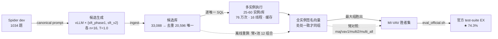

# MI-VAV：多实例执行分组投票（方法技术说明）

> 项目方法核心组件（L4 论文）。2026-08-15 实证：官方 test-suite EX = **74.3%**（全量 1034），
> 较旧最优 70.1% +4.2pp，较单实例 vav +7.1pp，距 FINER-SQL 官方 76.6% 差 2.3pp（且无大规模 GRPO）。
> 通俗版介绍见对话记录；本文档是技术版（伪代码 + 数据流 + 设计决策 + 复现方法）。

---

## 1. 问题定义

**选择缺口**：候选池的 Pass@K（池中至少一个候选正确）已达 94-95%（K=64），而多数票/单实例 vav 的 maj@K 只有 67-72%——生成侧已解决，瓶颈在"从池中选出正确候选"。

**官方-自评错位**：历史所有选择器在自评口径（单实例执行匹配）提升、在官方口径（test-suite 多实例严格等价）失效甚至反向（四证：MPEV 21pp、mixvav 自定义+/官方-、质心过滤 +0.5/-1.1、FINER 8.4pp）。

**根因**：旧 vav 分组只在一个数据库实例上比较执行结果，把"单实例巧合等价、多实例不等价"的候选并成一组，选出伪稳健答案。

**MI-VAV 的解法**：把分组判定搬到官方同款的多实例执行上——仅当两候选在**全部**数据库实例上的结果都一致才归同组。

---

## 2. 方法总览（三阶段）

| 阶段 | 内容 | 成本（实测） |
|---|---|---|
| ① 候选生成 | 两 checkpoint × 每题 n=16 采样（T=1.0, seed=0, top_p=1.0），vLLM 21× 加速 | 33088 次生成，3090 上 ~90 分钟 |
| ② 多实例执行 | 每个唯一 SQL 在题库全部实例（25-60 个/库）上执行，产出签名向量 | 760,777 次查询，16 线程 CPU **14 分钟** |
| ③ 分组投票 | 按"全实例签名向量完全相同"分组；最大组胜出 | 离线，秒级 |

### 伪代码

```
输入: 题 Q = (question, db_id, gold_sql)
      候选池 C = [(sql_1, w_1), ..., (sql_K, w_K)]   # w = SQL 归一化去重后的票数
      实例集 D = sorted(db_dir 下所有 *.sqlite)      # ≈25-60 个/库

# ---- 阶段 ② 多实例执行 ----
for 每个唯一 sql in C:
    for 每个实例 d in D:
        sig[sql][d] = canonical_exec_signature(sql, d)
        # 执行成功 → 行集排序后的规范形字符串（包语义，不比较列置换）
        # 执行返回 0 行 → 空签名（合法签名，P5 教训：不得与 ERROR 混淆）
        # 语法错/执行错/超时 → ERROR

# ---- 阶段 ③ 分组 ----
groups = {}
for 每个唯一 sql:
    vec = (sig[sql][d_1], sig[sql][d_2], ..., sig[sql][d_m])   # 全实例签名向量
    groups[vec].weight += w                                     # 票数加权

# 投票（FINER choose_group 语义的向量版）
valid = {vec: w for vec, w in groups
         if vec 不全为 ERROR and vec 非全零签名 and vec 非全空签名}
if valid:
    winner = max(valid, key=lambda v: (weight, str(vec)))   # 权重最大; 平票取向量字符串最大
else:
    winner = 文本多数票胜者                                    # fallback（实测触发率 7/1034）

# ---- 官方判定 ----
correct = official_exec_match(winner.sql, gold_sql)
          # = 官方 test-suite 语义: 每个实例上结果与 gold 包语义等价
          #   （order_matters = gold 含 'order by'; keep_distinct=False; 列置换容忍）
```

---

## 3. 数据流



---

## 4. 关键设计决策

| 决策 | 理由 |
|---|---|
| 分组用"行集规范形"、**不做列置换容忍** | 分组目标是"证据等级的分裂"，过度等价会把伪稳健答案并进正确组（官方判定才允许列置换） |
| 空结果（0 行）是合法签名 | P5 教训：旧 vav 把空结果组当退化组丢弃，曾丢 6.4pp |
| 全 ERROR 向量 / 全零签名 / 全空签名跳过 | FINER choose_group 语义的向量版，防"全失败组"当选 |
| 平票取向量字符串最大 | 确定性复现（照 FINER majority_voting） |
| 无有效组 → 回退文本多数票 | 保 1034 分母（实测 fallback 7/1034，占比极低） |
| 池消融（v1/v2/both）为候选子集 | 零额外执行，直接离线重算 |
| 生成与裁决解耦（候选库落盘） | "生成一次，实验 N 次"；12 个臂×池组合全部离线 |

---

## 5. 消融证据（全量 1034，官方语义判定）

**实例数阶梯（both 池）**——治疗效应随验收严格度单调上升：

| 分组使用的实例数 | 官方 EX |
|---|---|
| 0（文本多数票） | 66.8% |
| 1（旧 vav） | 67.2% |
| 2 | 71.5% |
| **全部（MI-VAV）** | **74.3%（+7.1pp）** |

**池构成消融（全实例分组）**——跨模型多样性增益：

| 池 | 官方 EX |
|---|---|
| v1 单独（16 候选） | 72.2% |
| v2 单独（16 候选） | 71.8% |
| **v1+v2（32 候选）** | **74.3%（+2.1pp）** |

**难度分解（MI-VAV both）**：easy 91.1 / medium 79.8 / hard 66.7 / extra 42.2。

**胜者来源**：vav 选出 1027/1034，fallback_maj 7，no_pool 0——投票机制健康。

---

## 6. 复杂度与成本

- 执行量：阶段② 76 万次（≈1034 × ~20 唯一 SQL × ~35 实例），实测 16 线程 828s；阶段③判定 12 万次 173s
- 内存 <1GB（签名以字符串存于字典；SQLite 只读 URI + 每线程独立连接）
- 缓存：跨相执行缓存（判定阶段复用分组阶段结果，命中 10,787 次）
- 剪枝：CTE 递归中断（进度回调）+ 墙钟 watchdog 超时，双路径防失控查询
- 候选去重后执行：33,088 → 20,596 唯一（省 ~38% 执行）

---

## 7. 复现方法（命令）

```bash
# ① 候选生成（3090 gpudebug 切片，断点续跑；~2-3 片 ×50min）
sbatch scripts/eval_pool_b1.slurm          # 输出 outputs/eval_pool_b1/

# ②+③ 裁决 + 官方复评（纯 CPU，cpu6348/32cores 分区，~20 分钟）
sbatch scripts/adjudicate_b1_cpu.slurm     # 输出 outputs/adjudicate_b1/ + official_adj_*/

# 关键产物
#   outputs/adjudicate_b1/summary.json                     # 臂×池准确率矩阵
#   outputs/adjudicate_b1/items_arm_vav_multi_all_both.json  # 主治疗胜者集
#   候选库: candidate_store/candidates.db                  # 可离线重算任何新臂
```

脚本：`src/eval_pool_b1.py`（生成，vLLM LoRARequest 双模型）、`src/adjudicate_pool.py`（1004 行裁决器，53 项单元断言）、`src/candidate_store.py`（候选库）。

---

## 8. 局限性（论文 Discussion 素材）

1. **实例冗余假设**：test-suite 实例高度冗余，`--max-instances` 可降成本；其他 benchmark（BIRD 等）无多实例库，方法需泛化（L8 跨任务验证的主题）
2. **gold 执行失败**：8/1034 题 gold 自身执行失败，按错计（官方 assert 行为的一致性处理）
3. **成本随实例数线性**：760K 执行 = 14 分钟可接受；若上更大题库需按库分片
4. **vav1 与 FINER 原版 vav 签名口径有差异**（行排序 vs 行内值排序+去重+200 截断）：跨实验对比需注明
5. **胜者仍是"池内最优"**：池里没有正确答案的 ~5% 题（Pass@K 缺口）无法被任何选择器救回——后续靠 sft_v3 抬池质量（B2）

---

## 9. 在论文中的定位

- **L4（改进版论文）方法核心**：MI-VAV + 跨 checkpoint 池。故事线："不靠更强训练，靠更严格的执行分组投票——把官方 test-suite 的多实例语义搬进测试时选择，3B 模型逼近 ICDE 方法"
- **L7（机制论文）证据中枢**：选择缺口（Pass 95 vs maj 67-71）与"验收严格度-成绩阶梯"（66.8→67.2→71.5→74.3）是《When Does Voting Fail?》的两张主图
- **B2（进行中）**：sft_v3 加入池（v1+v2+v3 × 16 → MI-VAV），预期 75-76%，正面逼近 FINER 官方 76.6%
